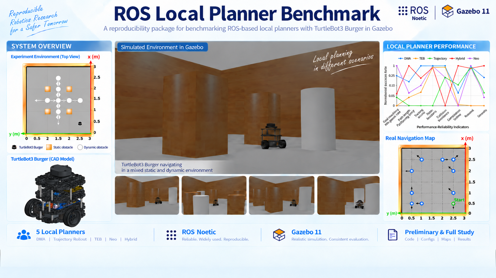
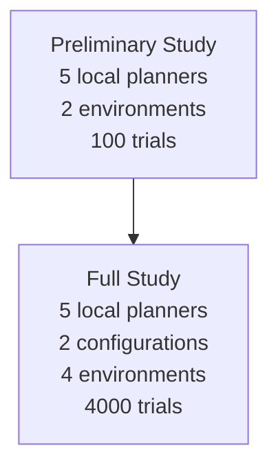
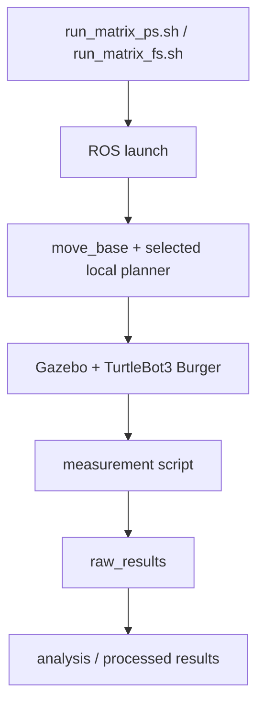

<p align="center">
  
</p>

# ROS Local Planner Benchmark and Reproducibility Package

## Project Overview

This repository is a ROS Noetic reproducibility package for benchmarking ROS-based local planners with TurtleBot3 Burger in Gazebo. It preserves the validated source code, parameters, environments, experiment protocols, archived results, and documentation for two study scopes: the Preliminary Study and the larger Full Study.

The benchmark evaluates five ROS-based local planners. DWA and Trajectory Rollout are distributed through the classical ROS Navigation ecosystem, while TEB, Neo Local Planner, and Hybrid Local Planner are separately distributed ROS-compatible local planner plugins integrated into the same `move_base`-based evaluation framework.

## Evaluated Local Planners

| Local planner | ROS plugin | Source origin |
| --- | --- | --- |
| DWA | `dwa_local_planner/DWAPlannerROS` | ROS Navigation Stack |
| Trajectory Rollout | `base_local_planner/TrajectoryPlannerROS` | ROS Navigation Stack |
| TEB | `teb_local_planner/TebLocalPlannerROS` | `teb_local_planner` 0.9.1 |
| Neo Local Planner | `neo_local_planner/NeoLocalPlanner` | Neobotix Neo Local Planner source |
| Hybrid Local Planner | `hybrid_local_planner/HybridPlannerROS` | Hybrid Local Planner by Fahim Shahriar |

## Study Structure



The Preliminary Study is the baseline comparison. The Full Study extends it with more transitions, repetitions, environment categories, and parameter-configuration modes.

## Repository Structure

```text
.
├── lpb_ws/
│   └── src/
│       ├── dwa_local_planner/
│       ├── base_local_planner/
│       ├── teb_local_planner/
│       ├── neo_local_planner/
│       ├── hybrid_local_planner/
│       ├── navigation packages...
│       ├── turtlebot3/
│       ├── turtlebot3_msgs/
│       ├── turtlebot3_simulations/
│       ├── my_nav_cfg/
│       └── test/
├── studies/
│   ├── preliminary_study/
│   └── full_study/
├── README.md
├── DEPENDENCIES.md
├── SOURCE_PROVENANCE.md
├── CITATIONS.bib
├── CITATION.cff
├── LICENSE
├── LICENSES.md
├── LICENSES/
├── install_dependencies.sh
└── .gitignore
```

## System Requirements

- Ubuntu 20.04
- ROS Noetic
- Gazebo 11
- `catkin_make`
- `rosdep`
- `git` (for cloning from GitHub)

The repository is validated on Ubuntu 20.04.6 LTS with ROS Noetic and Gazebo 11.15.1.

## Installation

```bash
git clone https://github.com/OmerMTKaya/ros_local_planner_benchmark.git
cd ros_local_planner_benchmark
./install_dependencies.sh
```

No additional local planner or project source repository needs to be cloned after cloning this repository. Normal apt/rosdep system packages may still be installed by the dependency script.

## Build

Start from a clean ROS session:

```bash
source /opt/ros/noetic/setup.bash
cd lpb_ws
catkin_make
source devel/setup.bash
```

Do not source another historical ROS workspace before building or running this repository. After building, source this repository's `lpb_ws/devel/setup.bash`.

## Quick Start

Preliminary Study:

```bash
cd lpb_ws
source devel/setup.bash
./src/test/run_matrix_ps.sh
```

Full Study:

```bash
cd lpb_ws
source devel/setup.bash
./src/test/run_matrix_fs.sh
```

The retained TurtleBot3 navigation launch now falls back to the benchmark model (`burger`) when `TURTLEBOT3_MODEL` is unset, so no separate model export is required for the documented matrix scripts. An explicitly set `TURTLEBOT3_MODEL` still overrides this fallback.

## Output Structure

- Preliminary Study raw results: `lpb_ws/src/test/docs_tables_media/preliminary_study/raw_results/`
- Full Study raw results: `lpb_ws/src/test/docs_tables_media/full_study/raw_results/`
- Full Study processed results: `lpb_ws/src/test/docs_tables_media/full_study/editted_results/`

## Reproducing The Analyses



The matrix scripts execute the full experiment protocols. Analysis and figure/table scripts are stored under `lpb_ws/src/test/scripts/fig&table_creator/`.

## Source Provenance

Validated source/configuration copies are included in `lpb_ws/src/`. See `SOURCE_PROVENANCE.md` for Navigation, TEB, Neo Local Planner, Hybrid Local Planner, and TurtleBot3 provenance.

## Reproducibility Notes

The repository preserves the validated source code, parameters, environments, and experiment protocols. Minor numerical variation between repeated Gazebo runs may occur because of simulator timing and runtime scheduling, but the experimental structure, output schema, and configured methodology are preserved.

## Related Publications

### Preliminary Study

The Preliminary Study is the initial/baseline local planner comparison.

```bibtex
@inproceedings{okatan2026comparison,
  author = {Okatan, Beyza Nur and Kaya, {\"O}mer Mutlu T{\"u}rk and Uslu, Erkan},
  title = {A Comparison of Local Planners in Classical Hierarchical ROS Navigation Stack},
  booktitle = {The 6th International Conference on Electrical, Computer, Communications and Mechatronics Engineering},
  year = {2026},
  address = {Bali, Indonesia},
  eventdate = {2026-10-15/2026-10-17},
  note = {Accepted for publication; final bibliographic metadata pending}
}
```

### Full Study

The Full Study extends the Preliminary Study with a larger performance-reliability evaluation.

```bibtex
@article{kaya2026comprehensive,
  author = {Kaya, {\"O}mer Mutlu T{\"u}rk and Uslu, Erkan},
  title = {Comprehensive Performance-Reliability Analysis of ROS-Based Local Planners},
  journal = {Engineering Science and Technology, an International Journal},
  volume = {83},
  pages = {102524},
  year = {2026},
  doi = {10.1016/j.jestch.2026.102524}
}
```

## How To Cite

If you use this repository, its experimental framework, scripts, configurations, or results in academic work, please cite the corresponding publication(s) listed in `CITATIONS.bib`.

- Cite the Preliminary Study when using or reproducing the Preliminary Study.
- Cite the Full Study when using or reproducing the Full Study.
- Cite both when your work materially draws from both study scopes.

`CITATION.cff` is provided for GitHub citation support.

## Licenses And Attribution

Original research-authored materials in this repository are released under GPL-3.0-only where indicated. Upstream ROS, local planner, and TurtleBot3 components retain their original licenses. See `LICENSE` and `LICENSES.md`.

## Limitations

- The validated baseline is Ubuntu 20.04, ROS Noetic, and Gazebo 11.
- The source package revisions are preserved as retained local metadata allows; exact commits are not recoverable for every repository-contained component.
- Archived result values should not be overwritten during smoke testing or exploratory runs.
